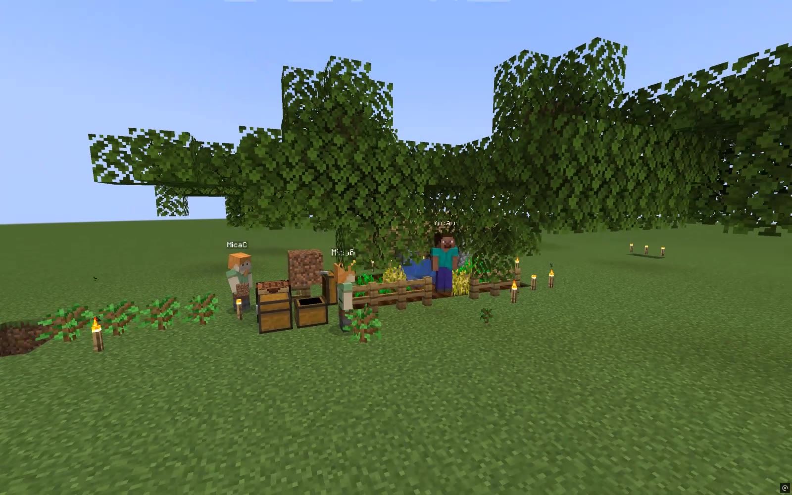

# Minecraft × Threshold — public experiment archive

**看 / 审 / 复现 · Watch / audit / reproduce.** September 18–19, 2026 (Asia/Shanghai). These are exploratory runs, not a benchmark or evidence of consciousness or an emergent society. English and 中文 discussion are welcome.

三个独立 Pi worker 通过 Threshold 围绕同一个 Minecraft 世界工作。探索逐步改变资源、项目历史通道，以及是否更换全部 Run。新 worker 能继续一些工作，也会误判设施、重复建设、给出错误解释。最有意思的案例是：一位 worker 制作石铲并放入公共箱，另外两位没有取用。

共同目标从一开始就包含庇护、公共储物和食物来源；没有指定职业、队长或协作协议。不能把它描述成“完全不给目标，社会自动出现”。

## 看 / Watch

G2 公开录像约04:30的画面；点击下面材料链接观看完整保留区间。

[全部附件 / Release](https://github.com/Key-of-door/Threshold-capability/releases/tag/minecraft-archive-2026-09-v1) · [关键事件与时间码](EPISODES.md) · [素材与时钟说明](MEDIA.md)

游戏文件是原始录屏的静音观看副本：校正180度倒置、降为1600×1000/30fps，删去无关桌面区间。不配剧情、不重排事件、不加模型内心独白。保留的区间与原片时间映射见 VIDEO-EDITS.json。不是逐字节原始视频；带原声和私人桌面的母片不公开。第一轮 S02 没有找到游戏录像。

CLI MP4 每张真实采样快照显示3秒，**不是实时连续录屏**。真实时间见各组 recording/snapshots.json 和 threshold.cast。历史关闭时观察者 CLI 仍能显示旧记录；Agent 实际输入以 epistemic trace 为准。

| Group | Start (UTC) | Model | Model turns | Output tokens | Materials |
|---|---|---|---:|---:|---|
| S02 | 2026-09-18T10:11:30.867Z | deepseek-flash | 120 | see report | [report](reports/S02.md) / [data ZIP](https://github.com/Key-of-door/Threshold-capability/releases/download/minecraft-archive-2026-09-v1/S02-data.zip) / game missing / [CLI](https://github.com/Key-of-door/Threshold-capability/releases/download/minecraft-archive-2026-09-v1/S02-cli.mp4) |
| S03 | 2026-09-18T11:19:07.312Z | deepseek-flash | 342 | 258887 | [report](reports/S03.md) / [data ZIP](https://github.com/Key-of-door/Threshold-capability/releases/download/minecraft-archive-2026-09-v1/S03-data.zip) / [game](https://github.com/Key-of-door/Threshold-capability/releases/download/minecraft-archive-2026-09-v1/S03-minecraft-silent.mp4) / [CLI](https://github.com/Key-of-door/Threshold-capability/releases/download/minecraft-archive-2026-09-v1/S03-cli.mp4) |
| S05 | 2026-09-18T14:25:58.748Z | deepseek-flash | 475 | 316039 | [report](reports/S05.md) / [data ZIP](https://github.com/Key-of-door/Threshold-capability/releases/download/minecraft-archive-2026-09-v1/S05-data.zip) / [game](https://github.com/Key-of-door/Threshold-capability/releases/download/minecraft-archive-2026-09-v1/S05-minecraft-silent.mp4) / [CLI](https://github.com/Key-of-door/Threshold-capability/releases/download/minecraft-archive-2026-09-v1/S05-cli.mp4) |
| RC | 2026-09-18T15:53:33.256Z | deepseek-flash | 456 | 269533 | [report](reports/RC.md) / [data ZIP](https://github.com/Key-of-door/Threshold-capability/releases/download/minecraft-archive-2026-09-v1/RC-data.zip) / [game](https://github.com/Key-of-door/Threshold-capability/releases/download/minecraft-archive-2026-09-v1/RC-minecraft-silent.mp4) / [CLI](https://github.com/Key-of-door/Threshold-capability/releases/download/minecraft-archive-2026-09-v1/RC-cli.mp4) |
| RI | 2026-09-18T16:11:20.653Z | deepseek-flash | 455 | 258137 | [report](reports/RI.md) / [data ZIP](https://github.com/Key-of-door/Threshold-capability/releases/download/minecraft-archive-2026-09-v1/RI-data.zip) / [game](https://github.com/Key-of-door/Threshold-capability/releases/download/minecraft-archive-2026-09-v1/RI-minecraft-silent.mp4) / [CLI](https://github.com/Key-of-door/Threshold-capability/releases/download/minecraft-archive-2026-09-v1/RI-cli.mp4) |
| H0 | 2026-09-18T18:16:40.519Z | deepseek-flash | 503 | 264472 | [report](reports/H0.md) / [data ZIP](https://github.com/Key-of-door/Threshold-capability/releases/download/minecraft-archive-2026-09-v1/H0-data.zip) / [game](https://github.com/Key-of-door/Threshold-capability/releases/download/minecraft-archive-2026-09-v1/H0-minecraft-silent.mp4) / [CLI](https://github.com/Key-of-door/Threshold-capability/releases/download/minecraft-archive-2026-09-v1/H0-cli.mp4) |
| H1 | 2026-09-18T18:35:27.924Z | deepseek-flash | 477 | 350587 | [report](reports/H1.md) / [data ZIP](https://github.com/Key-of-door/Threshold-capability/releases/download/minecraft-archive-2026-09-v1/H1-data.zip) / [game](https://github.com/Key-of-door/Threshold-capability/releases/download/minecraft-archive-2026-09-v1/H1-minecraft-silent.mp4) / [CLI](https://github.com/Key-of-door/Threshold-capability/releases/download/minecraft-archive-2026-09-v1/H1-cli.mp4) |
| G2 | 2026-09-18T19:18:01.188Z | deepseek-flash | 518 | 281829 | [report](reports/G2.md) / [data ZIP](https://github.com/Key-of-door/Threshold-capability/releases/download/minecraft-archive-2026-09-v1/G2-data.zip) / [game](https://github.com/Key-of-door/Threshold-capability/releases/download/minecraft-archive-2026-09-v1/G2-minecraft-silent.mp4) / [CLI](https://github.com/Key-of-door/Threshold-capability/releases/download/minecraft-archive-2026-09-v1/G2-cli.mp4) |

## 审 / Audit

表中 model turns 是各组 `finished.json` 的计数口径；S02 的120包含前置 MicaProbe 验证，Run 列表因此有4个身份，不是4个正式并行 worker。不要把这张表直接当作同口径实验评分。

先看 [条件与限制](CONDITIONS.md)，再按 [EPISODES](EPISODES.md) 的 UTC / Run / action ID 定位。每组 ZIP 解压后形成 S02/、H0/、G2/ 等目录；另下载 [archive-index.zip](https://github.com/Key-of-door/Threshold-capability/releases/download/minecraft-archive-2026-09-v1/archive-index.zip) 并解压到同一目录，得到 FILE-MANIFEST.json、REDACTIONS.json 和 episodes/。

- **Epistemic:** traces/Mica*/observations.jsonl、epistemic.jsonl：返回给 worker 的观察、项目内容及已记录的 provider 请求。隐藏推理不在公开档案中，也不是分析依据。
- **Mechanical:** traces/mechanical.jsonl、动作请求/结果、world-diff、world-facts、snapshots/：采样现实与保存的世界。动作返回 completed 不自动证明目标效果。
- **Interpretation:** public-output、Message、checkpoint、报告中的解释；这些不自动成为世界事实。

公开的是完整的已导出轨迹文件（不是只挑成功片段），附文件哈希与记录数；仍不是每个 server tick 的全知记录。部分早期字段/run_id 为空，原样保留，结合 bot_id、时间和 Run 列表定位。

## 复现 / Reproduce

[步骤、版本和可执行离线核验](REPRODUCE.md)。优先复算存档与输入条件；重新运行模型需要自己的凭据和环境，输出不可能保证一致。历史 runner 使用本机路径，并非受支持的通用产品入口。提供单独的 G2 准备脚本来重建公开数据副本，绝不恢复私有 auth/Run token。

## 最强能说到哪里

这些运行支持：在本组有界条件下，部分材料与工作可跨 fresh Run 接续；显式项目历史关闭后仍可能出现针对可见活动的供给尝试。**没有证明**长期稳定协作、整体认知收敛、普遍不需要通信，或石铲供给让接收者获益。三位 worker 仍有共同任务、Minecraft 先验、各自本轮 conversation、共享地形/库存和操作者继续提示。

Threshold core 在实验中没有增加 World / Character / Leader 等概念。研究 hook、channel gate 和编排都在外围；安装这些文件不意味着任何 Run 自动加载它们。

## 文件与权利说明

本目录代码沿用仓库 Apache-2.0 许可。录屏和 Minecraft 存档是本实验材料，包含 Minecraft 游戏内容；不分发客户端、server.jar、账号文件或第三方依赖二进制，也不主张拥有第三方游戏素材的权利。复现实验请自行取得 Minecraft / Java / 模型服务。

请不要上传 API key、auth.json 或私人项目数据。发现档案错误时，给出组别、UTC/动作 ID 和实际观察即可，不必先形成完整解释。
