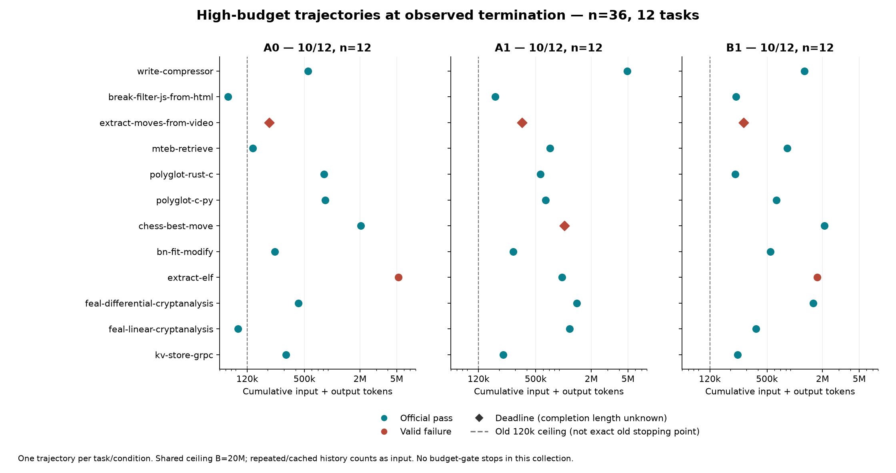
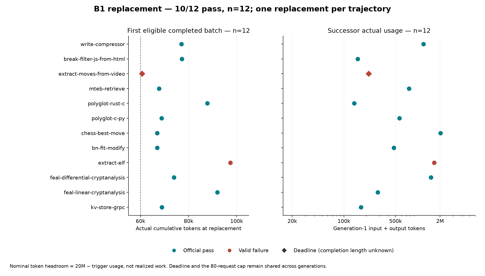

# Threshold × Terminal-Bench: from tight-budget results to a budget-relaxed replication

Editorial synthesis prepared 2026-09-23 from separately retained studies. This is not a replacement for the historical reports. [中文](REPORT.zh.md)

## Main observation, with every task visible

In the high-budget collection, native Pi (A0), Threshold continuation (A1), and Threshold with one early fresh-worker replacement (B1) each passed 10/12, n=12. Each task/condition was sampled once. All 36 graders were valid and all 36 input audits recorded no_contamination_observed within the stated scope.

| Task (12 tasks; one trajectory per cell) | A0 (n=12) | A1 (n=12) | B1 (n=12) |
| --- | --- | --- | --- |
| write-compressor | 1 | 1 | 1 |
| break-filter-js-from-html | 1 | 1 | 1 |
| extract-moves-from-video | 0 | 0 | 0 |
| mteb-retrieve | 1 | 1 | 1 |
| polyglot-rust-c | 1 | 1 | 1 |
| polyglot-c-py | 1 | 1 | 1 |
| chess-best-move | 1 | 0 | 1 |
| bn-fit-modify | 1 | 1 | 1 |
| extract-elf | 0 | 1 | 0 |
| feal-differential-cryptanalysis | 1 | 1 | 1 |
| feal-linear-cryptanalysis | 1 | 1 | 1 |
| kv-store-grpc | 1 | 1 | 1 |

1 = official pass; 0 = valid failure. All 36 graders valid. Equal totals do not mean identical failures.

| Condition | Pass / valid (n) | Normal | Deadline | Input | Output | Total tokens | Requests | Replacements |
| --- | --- | --- | --- | --- | --- | --- | --- | --- |
| A0 | 10/12, n=12 | 11 | 1 | 10443662 | 490221 | 10933883 | 262 | 0 |
| A1 | 10/12, n=12 | 10 | 2 | 11879706 | 508859 | 12388565 | 316 | 0 |
| B1 | 10/12, n=12 | 11 | 1 | 9368429 | 691035 | 10059464 | 360 | 12 |

## 1. What was being tested

A0→A1 examines normal Project integration under a shared runtime configuration. A1→B1 examines the specified early replacement boundary while task application state and Project persist. These are independent matched rollouts, not identical-prefix counterfactuals. A0 uses native Pi without Threshold Project tools, but follows the shared experimental budget, retry and execution policies; it is not a claim about every out-of-the-box Pi default.

The subset was frozen before formal results: seed `threshold-tb21-pilot-20260921-v1`; SHA256(seed/task) lexicographic selection; 12 selected from 62 eligible tasks. The upstream revision, eligibility audit, exclusions and order are in [formal-subset-v1.json (in evidence ZIP)](https://github.com/Key-of-door/Threshold-capability/releases/download/terminal-bench-archive-2026-09-v1/Threshold-TB-public-archive-20260923.zip). Results are not representative of all TB2.1 by default. Development tasks are excluded from formal selection.

## 2. Original v1 remains a result

Original formal v1 used B=120k input+output and R=B/2. Of 36 slots, 30 started, six were setup-invalid, and one started trajectory had an invalid grader. Valid passes were A0 4/9, A1 2/10 and B1 1/10. Twenty-five started trajectories hit input reservation; four ended with length responses; one recorded normal completion. Task-level scores, raw invalid outcomes and all preparation failures remain in the original dataset.

This is an observation under a tight ceiling **and its frozen conservative admission rule**, not a result to discard because later conditions improved. It also does not equal exactly 120k of usable model work per trajectory.

## 3. Diagnostics changed the interpretation, not the old data

The sequence was: formal v1 anomaly → integration/input inspection → P0/P1 post-orientation workflow diagnostic → active budget censoring identified → Q0/Q1 direct-task orientation diagnostic → return to original A0/A1/B1 contrast with relaxed ceiling → integrity audit.

P0/P1 changed four post-orientation instructions in the startup **user** turn. The system prompt, required first read_task and indirect task delivery stayed fixed. Four post-hoc selected tasks × three repetitions per arm did not establish stable P1 improvement. All 23 valid trajectories were reservation-stopped. A FEAL P1 solver produced a key matching 32 public samples, but lacked the required plaintext artifact; the next inference opportunity was blocked. This does not award partial credit or prove the unique hidden key.

Q0/Q1 gave both arms the full task immediately and ample budget, changing only required versus optional read_task guidance. Of 24 planned trajectories, 23 were valid and all 23 passed; one transport-invalid trajectory remains. No valid trajectory hit deadline or quota. Q1 voluntarily read_task in 9/12, including 6/12 first responses. Q0's requirement was a prompt, not a hard sequencing hook. This is the total orientation-guidance contrast under direct delivery, not pure goal salience and not a causal old/new budget comparison.

| Study | Condition | Planned | Pass / valid | Invalid | Normal | Budget stops |
| --- | --- | --- | --- | --- | --- | --- |
| P | P0 | 12 | 8/12, n=12 | 0 | 0 | 12 |
| P | P1 | 12 | 8/11, n=11 | 1 | 0 | 11 |
| Q | Q0 | 12 | 11/11, n=11 | 1 | 11 | 0 |
| Q | Q1 | 12 | 12/12, n=12 | 0 | 12 | 0 |

Each study: four tasks, three repeats per condition; repetitions are not distinct benchmark tasks. No pooling across P and Q.

## 4. What high-budget replication changed

BB rose from 120k to 20M; RR was decoupled from B/2 and held at the original nominal 60k. Keeping R=0.5B would instead delay replacement to 10M and could eliminate the intended early perturbation. This is a budget-relaxed replication, not literal replication.

The original contrast, task order, startup/task-delivery semantics, 80-request cap, task deadlines, model settings and runtime policies were retained. No P1/Q prompt or 1000-request cap was imported. Task preflight was repeated; all 12 tasks were now eligible, unlike original v1. Same nominal R does not imply identical realized prefixes or wall-clock timing. Removing the tight remaining-budget output clamp can itself allow longer responses before a completed boundary.

DeepSeek alias deepseek-flash / max, C=1,048,576, O=393,216; Pi0.85.1; core commit c53006438588b0b43500fa2481278dda85ce3f4c. Provider fingerprint is observable metadata, not a backend version guarantee. CPU1/RAM2GiB/memory+swap4GiB; 10GiB storage was not hard-enforced. Original retry/compaction/estimator settings are in the frozen policy and as-run files.

## 5. Budget utilization and replacement

Known usage totals 33,381,912 tokens (31,691,797 input + 1,690,115 output) across 938 requests. No unknown reserve, compaction, provider/stream/adapter error or token/request/authorization stop occurred. Thirty-two trajectories completed normally; four reached their original task deadline. The largest trajectory used 5,195,459 tokens. No authoritative monetary invoice is available.

All 12 B1 replacements occurred at the first eligible completed batch after >=60k, with actual trigger usage 60,624–97,365. Old runtime exits preceded new starts. All fresh first requests lacked old assistant/tool conversation. These are checks of recorded execution, not claims that Project/files/messages or provider internal state were erased.

Thirteen old-generation terminal-batch tool results were not delivered to another old-generation inference. Their effects could persist for reconstruction; the treatment does not promise one last old-worker observation. Persisted Project records may also describe effects, so “fresh worker can only use files” would overstate the boundary. Successor consumption is not all reconstruction overhead. [Full replacement measurements](tables/D-replacement.md) distinguish token headroom, actual use, remaining requests and remaining time.

## 6. Historical comparison, without a causal shortcut

| Study | Condition | Planned | Pass / valid | Pass / common valid (n=9) |
| --- | --- | --- | --- | --- |
| original-formal-v1 | A0 | 12 | 4/9, n=9 | 4/9, n=9 |
| original-formal-v1 | A1 | 12 | 2/10, n=10 | 2/9, n=9 |
| original-formal-v1 | B1 | 12 | 1/10, n=10 | 1/9, n=9 |
| formal-v1-high-budget | A0 | 12 | 10/12, n=12 | 8/9, n=9 |
| formal-v1-high-budget | A1 | 12 | 10/12, n=12 | 8/9, n=9 |
| formal-v1-high-budget | B1 | 12 | 10/12, n=12 | 8/9, n=9 |

Historical descriptive comparison, not a causal budget-effect estimate. Original failures and invalid cells remain in their dataset.

Common task intersection (determined only by validity):

- write-compressor
- break-filter-js-from-html
- mteb-retrieve
- polyglot-rust-c
- chess-best-move
- bn-fit-modify
- extract-elf
- feal-linear-cryptanalysis
- kv-store-grpc

The intersection above requires all six cells per task to be valid across both collections, without examining success. It excludes the two originally setup-invalid tasks and original A0's grader-invalid video task. Calendar time, backend/network realization, valid coverage and stochastic trajectories still differ. Do not read the differences as a randomized estimate of budget alone.

## 7. Integrity audit and limitations

All 1,095 tool-call sequences were reviewed, with suspicious cases expanded, and 938 provider requests mechanically checked. The audit verified same-generation tool-result delivery, fresh inputs, lifecycle order, usage and official grader execution; 93 copied grader files matched frozen originals. Six failed /tests probes in three trajectories remain explicit attempted-access records, not erased because they did not return hidden content.

The review found no prohibited-input contamination within recorded scope. It was performed by the same Codex primary reviewer, not an independent panel. No exhaustive syscall/packet monitoring, private reasoning review or pretraining contamination audit exists. Runtime/config metadata and scoped tokens were partly visible, so this is a cooperative boundary, not hostile-agent isolation.

The frozen provider configuration was text-only: nine image reads became fixed omission notices. All visual-task outcomes remain included. Equal aggregate scores do not establish statistical equivalence, free replacement, general superiority, or that budget alone explains every earlier failure. This is one model/provider and one trajectory per task/condition.

## 8. Inspect and reproduce

[Evidence map](EVIDENCE-MAP.md) → per-study report → trace lines → raw grader → original/public manifests. [Claims table](claims.md) lists supported wording and prohibited stronger statements. [Reproduction checklist](REPRODUCTION.md) distinguishes offline evidence recomputation from fresh model execution. The latter is not verified as one-command portable and cannot guarantee identical stochastic outcomes.

Chinese reports remain original; English reports are translations. This synthesis is separately labeled editorial material. Publication safety redaction is logged per occurrence and never used to remove failures. The sealed evidence package preserves its preparation-time review metadata; this web edition supplies the public links.
